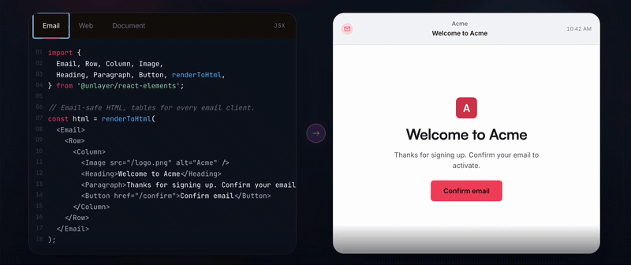

<p align="center">
  
</p>

<h1 align="center">Unlayer Elements</h1>

<p align="center">
  Write once in React. Render emails, web pages, and PDFs from the same component tree.
</p>

<p align="center">
  <a href="https://www.npmjs.com/package/@unlayer/react-elements"></a>
  <a href="https://github.com/unlayer/elements/actions/workflows/test.yml"></a>
  <a href="https://codecov.io/gh/unlayer/elements"></a>
  <a href="https://github.com/unlayer/elements/blob/main/LICENSE"></a>
  <a href="https://www.npmjs.com/package/@unlayer/react-elements"></a>
</p>

---

<p align="center">
  
</p>

Unlayer Elements is an open-source React component library that lets you build content once and render it across three output modes:

- **Email** → Outlook, Gmail, Yahoo, Apple Mail
- **Web** → Responsive pages and embedded experiences
- **Document** → Print-ready HTML for PDF generation

<p align="center">
  
</p>

Elements is built and maintained by the team behind [Unlayer](https://unlayer.com), the content creation platform used by thousands of companies to power email, page, and document experiences inside their products.

## Why Elements?

| Tool          | Email | Web | PDF |
|---------------|:-----:|:---:|:---:|
| React Email   |  ✅   | ❌  | ❌  |
| MJML          |  ✅   | ❌  | ❌  |
| PDF libraries |  ❌   | ❌  | ✅  |
| **Elements**  |  ✅   | ✅  | ✅  |

Elements is designed for teams that need to generate email, web, and document experiences from a single React codebase.

## Quick Start

```bash
npm install @unlayer/react-elements
```

```tsx
import {
  Email, Row, Column, ColumnLayouts,
  Heading, Paragraph, Button, renderToHtml
} from '@unlayer/react-elements';

function WelcomeEmail() {
  return (
    <Email backgroundColor="#f0f0f0" contentWidth="600px">
      <Row layout={ColumnLayouts.OneColumn} backgroundColor="#ffffff" padding="20px">
        <Column>
          <Heading
            fontSize="24px"
            fontFamily={{ label: "Arial", value: "arial,helvetica,sans-serif" }}
          >
            Welcome!
          </Heading>
          <Paragraph html="Thanks for signing up." fontSize="14px" />
          <Button
            href="https://example.com"
            backgroundColor="#0879A1"
            color="#ffffff"
          >
            Get Started
          </Button>
        </Column>
      </Row>
    </Email>
  );
}

// Render to a complete HTML document (<!DOCTYPE ...> to </html>) —
// email-client-safe shell included, no React hydration markers
const html = renderToHtml(<WelcomeEmail />);
```

## Features

### One Component Tree

Build content once and render it as email, web, or document. Share components, styling, and content across all three output modes from the same React codebase.

### React Developer Workflow

Works with React, Next.js, Remix, and Server Components. Use familiar JSX patterns and existing frontend workflows without learning a new templating language.

### Production Output

Generates email-safe HTML, responsive web HTML, and print-ready HTML for PDF generation — optimized output for each destination without maintaining separate implementations.

### Visual Builder Compatible

Export Unlayer-compatible design JSON with `renderToJson()` for round-tripping between code and the visual editor. Ideal for teams that want the flexibility of code alongside visual editing workflows.

### TypeScript First

Built with TypeScript from the ground up — full type definitions, autocomplete for components and props, and safer development with better IDE support.

### Clean HTML Output

`renderToHtml()` generates a complete, production-ready HTML document with no React hydration markers, no framework artifacts, and no client-side JavaScript required. Need to compose the document yourself? `renderToHtmlParts()` returns `{ head, body }` chunks.

### Lightweight & Tree-Shakeable

~12KB gzipped (under 60KB ESM), tree-shakeable, with zero client-side JavaScript required. Designed for performance-sensitive applications and server-side rendering environments.

## Real-World Use Cases

### Transactional Emails

Build and maintain order confirmations, password resets, and receipts from the same React codebase that powers your application.

### PDF Generation

Generate invoices, contracts, and reports server-side without maintaining a separate PDF system.

### CMS-Driven Content

Render content from a CMS, API, or database into emails, web pages, and documents using a shared component model.

### Email + Web Parity

Publish the same content as an email campaign, a web archive, and a public landing page from a single source of truth.

## Components

| Component | Description |
|-----------|-------------|
| `<Email>` | Root wrapper — email-safe HTML (tables for Outlook/Gmail) |
| `<Page>` | Root wrapper — responsive web (div + flexbox) |
| `<Document>` | Root wrapper — print/PDF optimized |
| `<Row>` | Layout container with column layout support |
| `<Column>` | Column inside a Row |
| `<Button>` | CTA button with hover states and links |
| `<Heading>` | Heading (h1–h4) |
| `<Paragraph>` | Rich text with plain text or HTML content |
| `<Image>` | Responsive image with alt text |
| `<Divider>` | Horizontal separator |
| `<Social>` | Social media icon links |
| `<Menu>` | Navigation menu |
| `<Table>` | Data table |
| `<Video>` | YouTube/Vimeo embed |
| `<Html>` | Custom HTML passthrough |

## Structure

Components follow a strict hierarchy:

```
<Email>              ← sets render mode
  <Row layout={…}>   ← layout container
    <Column>         ← must match layout column count
      <Button />     ← content components
      <Paragraph />
    </Column>
  </Row>
</Email>
```

## Column Layouts

```tsx
import { Row, Column, ColumnLayouts } from '@unlayer/react-elements';

// Each Row must contain the matching number of <Column> children.
<Row layout={ColumnLayouts.OneColumn}>                {/* [1]         → 100% */}
  <Column>{/* content */}</Column>
</Row>
<Row layout={ColumnLayouts.TwoEqual}>                 {/* [1,1]       → 50% + 50% */}
  <Column>{/* content */}</Column>
  <Column>{/* content */}</Column>
</Row>
<Row layout={ColumnLayouts.TwoWideNarrow}>            {/* [2,1]       → 67% + 33% */}
  <Column>{/* content */}</Column>
  <Column>{/* content */}</Column>
</Row>
<Row layout={ColumnLayouts.ThreeEqual}>               {/* [1,1,1]     → 33% each */}
  <Column>{/* content */}</Column>
  <Column>{/* content */}</Column>
  <Column>{/* content */}</Column>
</Row>
<Row layout={ColumnLayouts.FourEqual}>                {/* [1,1,1,1]   → 25% each */}
  <Column>{/* content */}</Column>
  <Column>{/* content */}</Column>
  <Column>{/* content */}</Column>
  <Column>{/* content */}</Column>
</Row>
<Row cells={[3, 1]}>                                  {/* custom ratio */}
  <Column>{/* content */}</Column>
  <Column>{/* content */}</Column>
</Row>
```

## Documentation

For the full API reference, component props, design patterns, and common mistakes, see the **[React package documentation](./packages/react/README.md)**.

## Packages

| Package | Description | Published |
|---------|-------------|-----------|
| [`@unlayer/react-elements`](./packages/react) | React components and renderers | [](https://www.npmjs.com/package/@unlayer/react-elements) |
| [`@unlayer-internal/shared-elements`](./packages/shared) | Framework-agnostic shared logic | Internal |
| [`@unlayer/elements-demo`](./packages/demo) | Demo application | — |

## Development

```bash
# Prerequisites: Node.js (see .nvmrc), pnpm 9+

# Install dependencies
pnpm install

# Build all packages
pnpm build

# Run tests
pnpm test

# Run tests with coverage
pnpm test:coverage

# Launch Storybook
pnpm storybook:hub
```

## FAQ

### What makes Elements production ready?

Elements generates its HTML with the same battle-tested engine that powers exports in the [Unlayer editor](https://unlayer.com), an engine used in production by thousands of companies for years. The engine version is pinned per release, and every component's output is locked down by snapshot tests, a golden-template test, and browser-level gates (see below), so upgrades cannot silently change the HTML you ship. Releases follow semantic versioning and each one is published with [release notes](https://github.com/unlayer/elements/releases), so any change to the API or output is visible before you upgrade.

### How is the email output actually tested?

Every release must pass, in CI:

- **Golden template test:** a full, realistic email rendered through all render pipelines and compared against committed output.
- **Snapshot tests:** every component rendered in both email and web modes.
- **Browser E2E gate:** complete documents rendered from the built package and verified in headless Chromium: responsive columns stack at the mobile breakpoint, paragraphs compute to true zero margins, RTL text direction propagates, button hover states apply, the preheader stays invisible, no horizontal overflow on mobile, and accessibility basics hold (image alt text, link names, `role="presentation"` on layout tables). The suite includes a negative control that must fail, proving the gate can catch regressions rather than just pass vacuously.
- **Visual-drift gate:** the computed styles of every Storybook story are fingerprinted at desktop and mobile widths and diffed against a committed baseline, so unintended style changes fail the build with property-level diffs.
- **Next.js integration test:** a real Next.js 15 app with Server Components builds against the published package artifact.

The email mode emits the same table-based, Outlook-safe HTML patterns as Unlayer's editor exports, which land in real inboxes every day. Our templates are tested on Litmus and Email on Acid across major email clients, including Outlook, Gmail, Yahoo, and Apple Mail.

### Is the PDF output a real PDF engine?

Yes, you can generate PDF files in two ways: use Unlayer's [PDF export service](https://docs.unlayer.com/builder/export-pdf) to get a finished PDF with a single API call, or pass the print-optimized HTML from `<Document>` to any HTML-to-PDF library. Pagination (page breaks, margins, and headers and footers) is controlled with standard CSS print rules plus your renderer's options.

### Can I use Elements without the Unlayer platform?

Yes. The package is MIT-licensed, makes no network calls, requires no API key or account, and has no runtime dependency on Unlayer's platform. `renderToHtml()` runs entirely in your own process, and the output is plain, static HTML that you own outright. The platform integrations (design-JSON round-tripping via `renderToJson()` and Custom Tools shared with the visual editor) are strictly opt-in: valuable if you also use the Unlayer builder, ignorable if you don't.

### Is there a visual editor for Elements?

Yes. Elements is fully compatible with the [Unlayer editor](https://unlayer.com), the drag-and-drop builder for emails, pages, and documents that you can embed in your own product. `renderToJson()` exports your component tree as Unlayer design JSON that loads directly into the editor, so developers can build templates in code and hand them off to non-technical teammates for visual editing. Custom Tools bridge the two as well: the same tool definition renders in the editor and in code.

### Can I create custom components?

Yes. `registerElementsTool()` turns a custom tool definition into a first-class React component with typed props and full control over its output in each render mode (email, web, and document). See the [Custom Tools documentation](./packages/react/README.md#custom-tools) for a complete example.

## Contributing

See [CONTRIBUTING.md](./CONTRIBUTING.md) for setup instructions and guidelines.

## License

[MIT](./LICENSE) — Unlayer, Inc.
